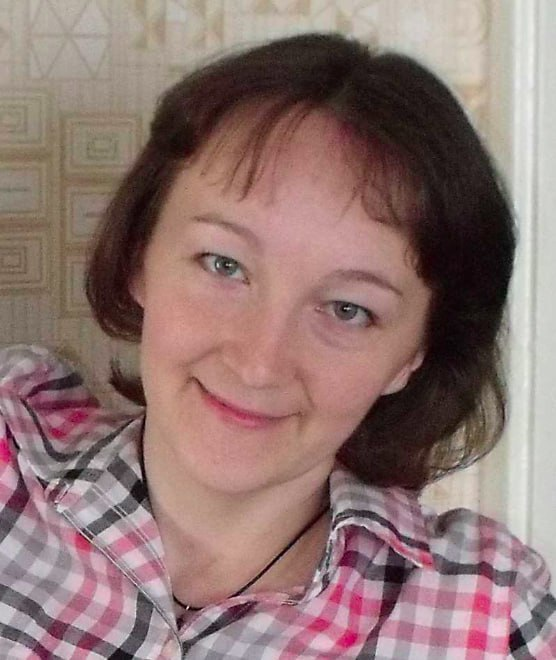

# Приятно познакомиться!

Меня зовут Лебедева София. Мне 41 год и я учусь в Нетологии.

## Цели
- Узнать свои возможности в программировании
- Узнать свой потенциал в смене полей деятельности
- Разнообразить свою работу

## Пройденные блоки обучения
- HTML-разметка и CSS
- Различные операционные системы
- Ручное тестирование веб-приложений
- Git и GitHub (в процессе)